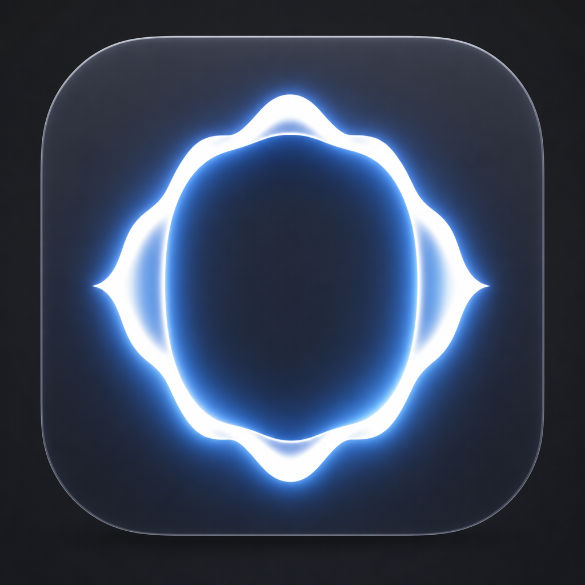

<div align="center">



# Otto

**A voice and text assistant for the Mac that learns how you work.**

[](https://www.apple.com/macos/)
[](https://swift.org)
[](https://github.com/slaymish/otto/releases)
[](LICENSE)

</div>

Summon Otto with a keystroke. Say what you want — _"open Spotify," "cut here," "what's on my screen?"_ — and it does it. No chat window, no context-switching. After each session Otto reflects on what worked and quietly rewrites its own memory, so the way *you* phrase something lands instantly next time.

The more you use it, the better it fits.

> Otto is a single native macOS app written in Swift. No Python, no Node, no runtime dependencies.

<br>

## Quickstart

**Requirements** — a Mac, Xcode Command Line Tools (`xcode-select --install`), and an **OpenAI API key with Realtime access**.

```bash
make app                  # build → Otto/build/Otto.app (no full Xcode needed)
open Otto/build/Otto.app  # launch
```

On first run, onboarding asks for your OpenAI API key (stored in the Keychain). Otto then lives in the menu bar — no Dock icon.

| Shortcut | Action |
|---|---|
| <kbd>⌥</kbd> <kbd>Space</kbd> | Summon / dismiss the command palette |
| *type, or hold the mic button* | Send a text command, or talk |
| <kbd>⌥</kbd> <kbd>⇧</kbd> <kbd>Space</kbd> | Open the journal to browse and edit what Otto has learned |

<br>

## How it works

Otto exposes five primitives to the model. Every command resolves to one of them:

| Primitive | What it does |
|---|---|
| `run_applescript` | Runs AppleScript in-process |
| `press_key` | Sends keystrokes via CGEvent |
| `read_screen` | Reads the accessibility tree of the focused app |
| `open_url` | Opens a URL in your browser |
| `obs_call` | Drives OBS over its WebSocket |

There are **no hardcoded routing rules**. When you speak, Otto retrieves the most relevant capability templates and hands them to the model as recipes to fill in.

<br>

## How it learns

After each session Otto runs a retrospective (`gpt-4o-mini`): it looks at what you said and what worked, then adds your phrasing to an existing capability or creates a new one. Results land in `capabilities.user.json` under `~/Library/Application Support/Otto/` — your personal capability library, local to your machine.

You never train it explicitly. Use it normally and it compounds. Review or undo anything from the journal (<kbd>⌥</kbd> <kbd>⇧</kbd> <kbd>Space</kbd>).

<br>

## Cost & privacy

- **$0 idle** — audio is only sent when you trigger a command.
- **A few cents per command** — `gpt-realtime-2` for live turns; cheap `gpt-4o-mini` for the retrospective.
- **Your data stays put** — session logs and learned capabilities live only on your machine.

<br>

## Configuration

Most settings live in the in-app Settings window — API key, mic, browser, hotkeys, launch-at-login. A few can be overridden with environment variables:

| Variable | Default | What it does |
|---|---|---|
| `OPENAI_API_KEY` | — | API key (overrides the Keychain value) |
| `OTTO_MODEL` | `gpt-realtime-2` | Realtime model |
| `OTTO_MIC` | system default | Mic to use (partial name match, e.g. `Scarlett`) |
| `OTTO_USER_NAME` | — | Your name, used in the system prompt |

<br>

## Adding a capability

Edit [`memory/capabilities.json`](memory/capabilities.json) and restart. Each entry looks like:

```json
{
  "id": "spotify-play",
  "description": "Play music in Spotify",
  "examples": ["play Spotify", "start music", "resume playback"],
  "primitive": "run_applescript",
  "template": "tell application \"Spotify\" to play",
  "required_apps": ["Spotify"]
}
```

`required_apps` excludes the capability from the index unless one of the listed apps is installed.

<br>

## Build & test

```bash
make app      # build Otto.app
make pkg      # build + wrap as Otto.pkg installer
make clean    # remove build output
```

Standalone Swift unit tests (no Xcode, no `Package.swift`):

```bash
swiftc Otto/Otto/HotkeyConfig.swift   tests/swift/HotkeyConfigTests.swift   -framework Carbon -o /tmp/hk && /tmp/hk
swiftc Otto/Otto/UpdateChecker.swift  tests/swift/UpdateCheckerTests.swift                    -o /tmp/uc && /tmp/uc
swiftc Otto/Otto/CapabilityKind.swift tests/swift/CapabilityKindTests.swift                   -o /tmp/ck && /tmp/ck
swiftc tests/swift/SessionLogTests.swift                                                       -o /tmp/sl && /tmp/sl
swiftc tests/swift/CapabilityIndexTests.swift                                                  -o /tmp/ci && /tmp/ci
```

<br>

---

<div align="center">

See **[CLAUDE.md](CLAUDE.md)** for the full architecture and a file-by-file breakdown.

MIT licensed · a fork of [voice-os](https://github.com/per-simmons/voice-os) by Pat Simmons

</div>
